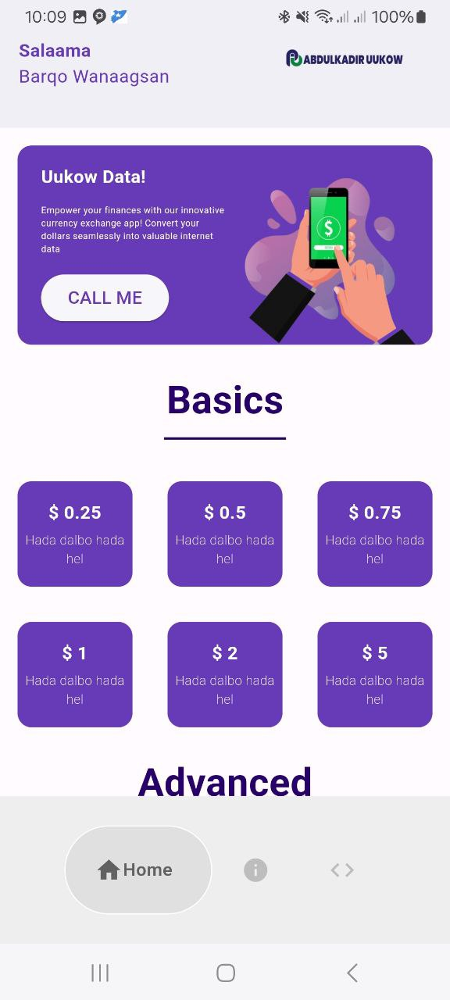
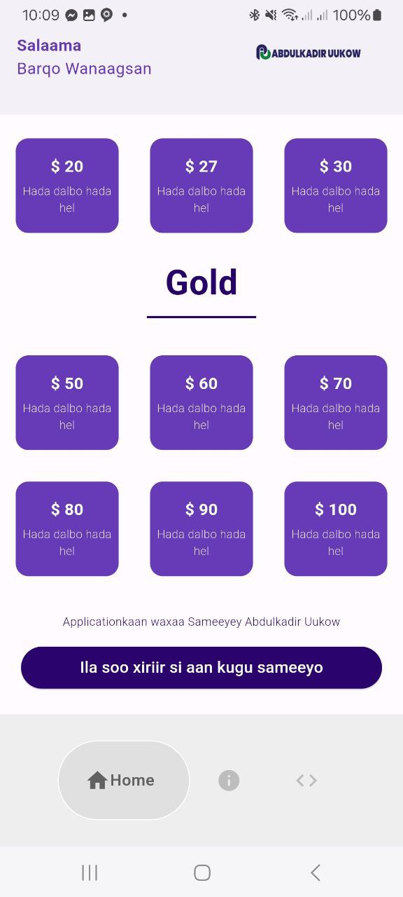
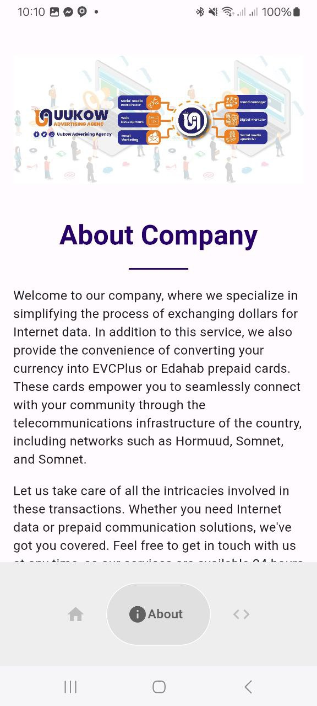
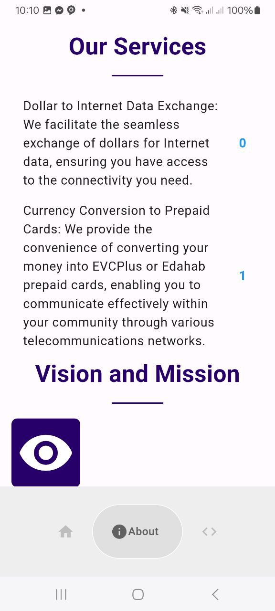
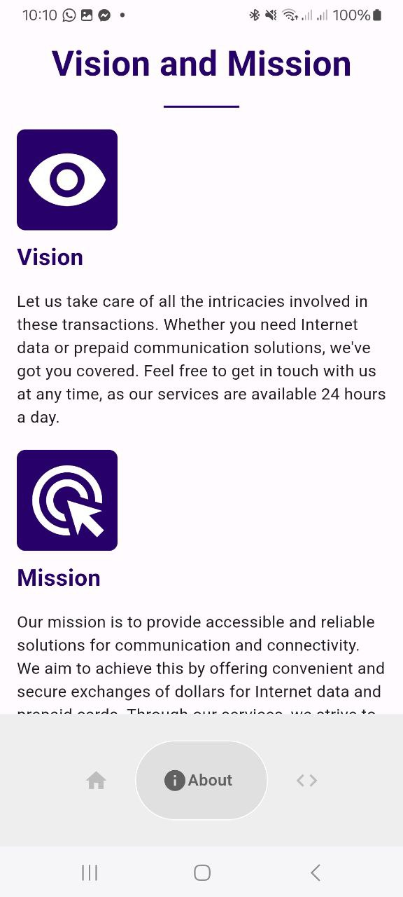

<div align='center'>

<h1>Mobile data Server Application</h1>
<p>our company, where we specialize in simplifying the process of exchanging dollars for Internet data. In addition to this service, we also provide the convenience of converting your currency into EVCPlus or Edahab prepaid cards. These cards empower you to seamlessly connect with your community through the telecommunications infrastructure of the country, including networks such as Hormuud, Somnet, and Somnet.</p>

<h4> <span> · </span> <a href="https://github.com/uukow/Mobile data server Server/blob/master/README.md"> Documentation </a> <span> · </span> <a href="https://github.com/uukow/Mobile data server Server/issues"> Report Bug </a> <span> · </span> <a href="https://github.com/uukow/Mobile data server Server/issues"> Request Feature </a> </h4>


</div>

# :notebook_with_decorative_cover: Table of Contents

- [About the Project](#star2-about-the-project)
- [Contributing](#wave-contributing)
- [Contact](#handshake-contact)


## :star2: About the Project

### :camera: Screenshots
<div align="center"> <a href=""></a> </div>


### :space_invader: Tech Stack
<details> <summary>Client</summary> <ul>
<li><a href="">Flutter</a></li>
</ul> </details>
<details> <summary>Server</summary> <ul>
<li><a href="">Dart</a></li>
</ul> </details>

### :dart: Features
- Home
- About
- Categories
- Developer


### :art: Color Reference
| Color | Hex |
| --------------- | ---------------------------------------------------------------- |
| Primary Color |  #0902c7 |
| Secondary Color |  #f52b07 |
| Accent Color |  #ffffff |
| Text Color |  #000000 |

## :toolbox: Getting Started

### :test_tube: Running Tests

Running
```bash
flutter run
```
update yaml
```bash
Pub dev
```


## :wave: Contributing

<a href="https://github.com/Uukow/Mobile-Data-Server-Application/graphs/contributors">  </a>

Contributions are always welcome!

see `contributing.md` for ways to get started

## :handshake: Contact

Abdulkadir Uukow - [@twitter_handle](https://twitter.com/abdulkadiruukow) - Abdulkadiruukow@gmail.com

Project Link: [https://github.com/Uukow/Mobile-Data-Server-Application](https://github.com/Uukow/Mobile-Data-Server-Application)


## :mobile: ScreenShots









